[TOC]

# 一、三角形

## 1. 内心

三角形内心（三角形内切圆的圆心）：三角形内角平分线的交点

已知三点坐标，求三角形内心坐标，[证明过程](https://www.zybang.com/question/272657890b84080ca669265cd181789c.html)

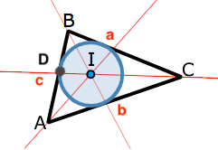

设 $a = |BC|, \space b = |AC|,\space c = |AB|$ 则
$$
(x_I,y_I) = {a(x_A,y_A)+b(x_B,y_B)+c(x_C,y_C) \over a+b+c}
$$


## 2. 垂心

三角形从顶点到其对边的三条高的交点

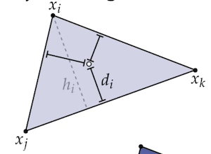

应用：三角形着色时，已知三个点的颜色，混合计算整个三角形的颜色（高度比求插值）
$$
\begin{align}
f_i &= d_i / h_i \\
Color &= f_i * Color_i + f_j * Color_j + f_k * Color_k
\end{align}
$$


## 3. 重心

三角形从顶点到其对边中点的交点，具体推到见 [纹理，重心坐标](../OpenGL/Part4_Texture.md)

应用：三角形着色时，已知三个点的颜色，混合计算整个三角形的颜色（面积比求插值）
$$
\begin{align}
f_i &= {area(x, x_j, x_k) \over area(x_i, x_j, x_k)} \\
Color &= f_i * Color_i + f_j * Color_j + f_k * Color_k
\end{align}
$$


## 4. 求面积

已知三点坐标，求证三角形面积 $S_{\Delta ABC} = {1 \over 2}[(x_2-x_1)(y_3-y_1) - (y_2-y_1)(x_3-x_1)]$

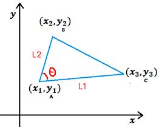
$$
\begin{align}
S_{\Delta ABC} 
&= {1 \over 2} |height||L_1| \\
&= {1 \over 2} |sin\theta||L_2||L_1| \\
&= {1 \over 2} \sqrt{1-(cos\theta)^2}|L_2||L_1| \\
&= {1 \over 2} \sqrt{1-({\vec {BA} \cdot \vec {CA} \over |L_2||L_1|})^2}\cdot |L_2||L_1| \\
&= {1 \over 2} \sqrt{(|L_1||L_2|)^2-(\vec {BA} \cdot \vec {CA})^2} \\
&= {1 \over 2} \sqrt{[(x_3 - x_1)^2 + (y_3-y_1)^2][(x_2-x_1)^2 + (y_2-y_1)^2]-[(x_2 - x_1)(x_3-x_1) + (y_2-y1)(y_3-y_1)]^2} \\
\end{align}
$$

设 $a=x_2-x_1, \space b=y_2-y_1, \space c=x_3-x_1, \space d=y_3-y_1$  则 

$$
\begin{align}
S_{\Delta ABC} 
&= {1 \over 2} \sqrt{(c^2 + d^2)(a^2 + b^2)-(ac + bd)^2} \\
&= {1 \over 2}|ad - bd| \\
&= {1 \over 2}|(x_2-x_1)(y_3-y_1) - (y_2-y_1)(x_3-x_1)|
\end{align}
$$


# 二、三维距离检测

常用的几何图元表示

```c++
class Line {
  vec3 Pos;
  vec3 Direction;
};

class Sphere {
  vec3 Center;
  vec3 Radius;
};

class Plan {      // 平面的普通表示 1
  vec3 Pos;
  vec3 Direction; 
};

class Plan {    	// 平面的化简表示 2
  vec3 Direction;
  vec3 Distance;  // 平面到原点的距离
};

class AABB {
  vec3 Min;
  vec3 Max;
};

class Triangle {
  vec3 Vector0;
  vec3 Vector1;
  vec3 Vector2;
};

class PlanBoundVolume {
  std::vector<Plane> Planes;
};
```


## 1. 点到直线的最近点

   其中 $L_{Dir}$ 是单位向量，$P_p,P_L,P_N$ 均为同一坐标系下点的坐标
$$
P_N = P_L + (L_{Dir} \cdot (P_p - P_L))L_{Dir}
$$

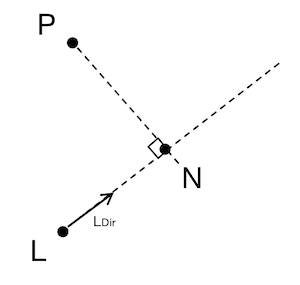


## 2. 点到线段 LA 的最近点

   其中 $L_{Dir}$ 是单位向量，$P_p,P_L,P_N,P_A$ 均为同一坐标系下点的坐标（截取思想）
$$
P_N = P_L + Clamp(L_{Dir} \cdot (P_p - P_L), 0, Length_{LA})L_{Dir}
$$

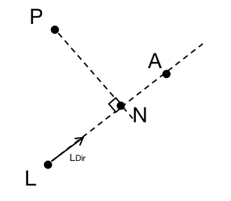


## 3. 点到 AABB 的最短距离（前提，点在 AABB 外部）

   > AABB 轴对齐碰撞箱（Axis-Aligned Bounding Box）
   >
   > - 碰撞箱为 矩形/立方体，它的边与所包围物体的**世界坐标系对齐**（为了便于计算碰撞箱）
   > - 不会随所包装物体的旋转而旋转，只会**随所包装物体的旋转而缩放**
   > - 表示方法有很多，通常用两个坐标系各轴都是模型中的点 最大/最小 的点来表示
   >   描述 AABB 的几何结构为：碰撞箱的中心点 + 碰撞箱子各个坐标轴的半径（为了方便碰撞检测）

   计算 $P$ 点和 $P_{nearest}$ 的距离，就是最短距离
$$
   P_{nearest} = AABB.Clamp(P)
$$

   ```c
   vec2 AABBClamp(vec2 p, AABB b)
   {
     return new vec2(
       Clamp(p.x, b.min.x, b.max.x),
       Clamp(p.y, b.min.y, b.max.y)
     );
   }
   ```


## 4. 点到平面的最近点

在三维空间中，需要 $Dir_{plan}$ 平面的方向（一般为单位向量），和平面中的任意一点 $P_{plan}$
$$
P_{Near} = P - Dir_{plan} \cdot (P - P_{plan})
$$
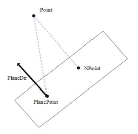


## 5. 点到三角形的最近点

步骤：求解点在三角形的哪个区域

1. 顶点区域（最近点是顶点）
2. 边区域（最近点是点到线短的距离）

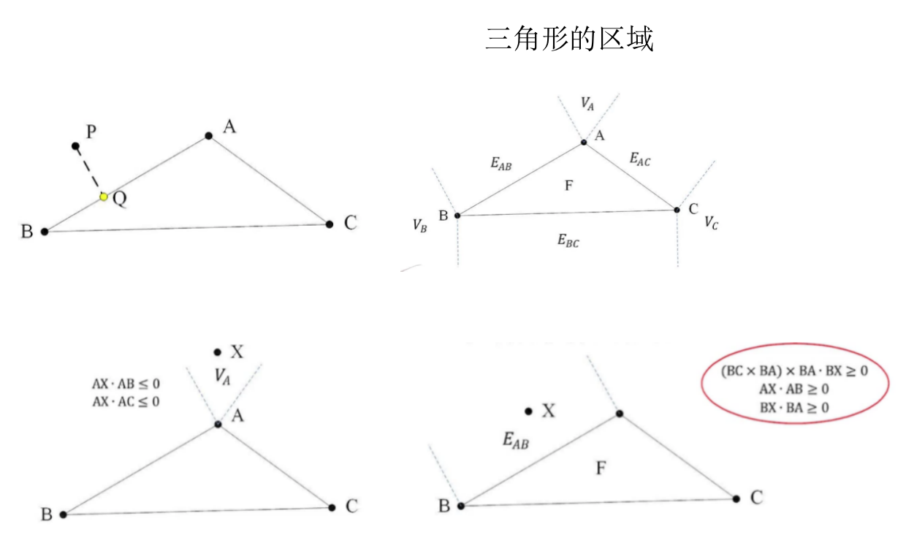


## 6. 点到四面体（模型）的最近点

遍历四面体的四个三角面，将点在三角面上做**投影**，求点到三角形的最近点

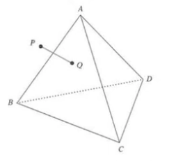


## 7. 凸包与凸包之间的距离

> 几何体与几何体之间的距离
>
> 凸包的性质：连接凸包任意两点的直线，都在这个凸包的内部


技巧：凸物体与球的最短距离，等价转换为凸膨胀体与点的距离

凸包与凸包之间的距离通用算法：GJK（Gilbert-Johnson-Keerthi distance algorithm）

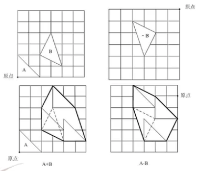


**工程化的计算凸包和凸包的距离**：通过有限次数的迭代 Support 点来求得两个凸包的近似距离


# 三、三维区域检测

## 1. 点与面的关系判断

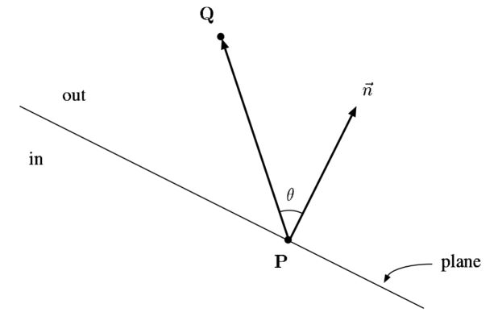

对于平面 plane 和其法线 $\vec n$

- $(Q-P) \cdot \vec n > 0$，Q 在平面 plane 外侧 out
- $(Q-P) \cdot \vec n = 0$，Q 在平面 plane 上
- $(Q-P) \cdot \vec n < 0$，Q 在平面 plane 内侧 in


## 2. 线与面的关系判断

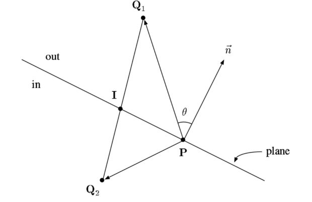

对于任意一条直线 $Q_1Q_2$，则

- $(Q_1-P) \cdot \vec n > 0, \space (Q_2-P) \cdot \vec n > 0$，直线 $Q_1Q_2$ 在平面 plane 外侧 out
- $(Q_1-P) \cdot \vec n < 0, \space (Q_2-P) \cdot \vec n < 0$，直线 $Q_1Q_2$ 在平面 plane 内侧 in
- $((Q_1-P) \cdot \vec n )* ((Q_2-P) \cdot \vec n) < 0$，直线 $Q_1Q_2$ 与平面 plane 有交点


# 四、区域划分

根据划分条件的不同，可以采用不同的划分结构

## 1. 划分条件

### 1.1 传统划分

### 1.2 空间划分


## 2. 划分结构

### 2.1 BVH 划分

### 2.2 K-D 树划分

### 2.3 Uniform Grids 划分


# 引用

1. [点到 AABB，点到 OBB 的最近点和距离](http://www.idivecat.com/archives/494)
2. [Distance Between Point and Triangle in 3D](https://www.geometrictools.com/Documentation/DistancePoint3Triangle3.pdf)
3. [从零开始手敲次世代游戏引擎（四十五）](https://zhuanlan.zhihu.com/p/34344829?from_voters_page=true)
4. [GJK 检测算法](https://www.cnblogs.com/alps/p/12822653.html)
5. [Building a Collision Engine Part 1: 2D GJK Collision Detection](https://blog.hamaluik.ca/posts/building-a-collision-engine-part-1-2d-gjk-collision-detection/)
6. [Clipping using homegeneous coordinates by James F. Blinn and Martin E. Newell](https://link.zhihu.com/?target=https%3A//fabiensanglard.net/polygon_codec/clippingdocument/p245-blinn.pdf)
7. [CLIPPING by Kenneth I. Joy](https://link.zhihu.com/?target=https%3A//fabiensanglard.net/polygon_codec/clippingdocument/Clipping.pdf)
8. [Clipping implementation](https://link.zhihu.com/?target=https%3A//fabiensanglard.net/polygon_codec/)

